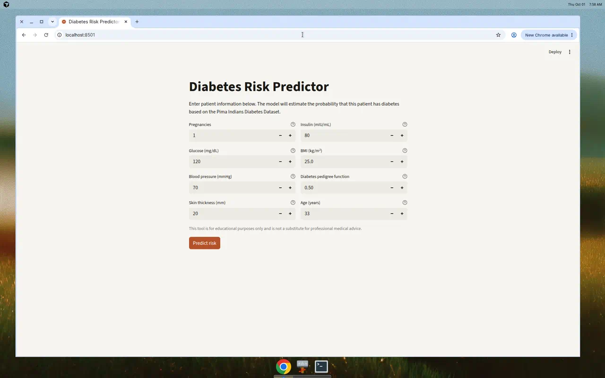

# AI Health Predictor

A single-model Random Forest baseline that turns 8 clinical measurements into a diabetes-risk probability. A focused, deployable ML pipeline.



**Live demo:** [AI Health Predictor on Streamlit Community Cloud](https://ai-health-predictor-i8szxik9c7k6sgeilydpui.streamlit.app/)  
The free host may sleep when idle; the first visit can take about 30 seconds to wake.

**Related:** Want to compare models? See [ai-health-coop](https://github.com/odwamanitshana/ai-health-coop).

## Features

- Interactive web UI for clinical metrics
- Real-time diabetes risk probability from a trained Random Forest
- Additional models trained in the notebook (Logistic Regression, Neural Network) for offline comparison
- Deployed demo · educational use
- Open source with trained model artifacts included

## Models and performance

| Model | Accuracy | Status |
|-------|----------|--------|
| Logistic Regression | ~73% | Baseline |
| Random Forest | ~76% | Deployed in this app |
| Neural Network | ~76% | Experimental |

**Selected model:** Random Forest — strong accuracy on this dataset with straightforward deployment compared to the experimental neural network.

## Quick start

### Prerequisites

- Python 3.x (tested on 3.13)
- pip or conda

### Installation

1. **Clone the repository**

   ```bash
   git clone https://github.com/odwamanitshana/ai-health-predictor.git
   cd ai-health-predictor
   ```

2. **Create a virtual environment**

   ```bash
   python -m venv .venv
   .venv\Scripts\activate  # Windows
   source .venv/bin/activate  # macOS/Linux
   ```

3. **Install dependencies**

   ```bash
   pip install -r requirements.txt
   ```

### Run locally

```bash
streamlit run app.py
```

The app opens at `http://localhost:8501`.

## Usage

1. Enter 8 clinical metrics (units are shown on each field).
2. Click **Predict risk**.
3. View the probability metric and high/low risk message, plus the medical disclaimer.

## Project structure

```
ai-health-predictor/
├── app.py                          # Main Streamlit application
├── requirements.txt                # Python dependencies
├── README.md                       # This file
├── assets/                         # Favicon and README screenshot
├── data/
│   └── diabetes.csv               # Pima Indians Diabetes Dataset (768 samples)
├── models/
│   ├── random_forest.pkl          # Model used by the app
│   ├── scaler.pkl                 # Feature scaler (used by other saved models)
│   ├── logistic_regression.pkl    # Baseline model
│   └── diabetes_nn.keras          # Neural network model
├── notebooks/
│   └── 01_data_preparation.ipynb  # Data exploration and model training
├── tests/
│   └── compare_app_notebook.py    # Example prediction smoke test
└── docs/
    ├── project_reflection.md       # Detailed project reflection
    └── PRESENTATION.md             # Presentation notes
```

## Dataset

**Source:** Pima Indians Diabetes Dataset  
**Samples:** 768  
**Features:** 8 clinical measurements  
**Target:** Binary (Diabetes: Yes/No)  
**Split:** 70% train / 15% validation / 15% test

## Data pipeline

1. **Loading and exploration** — missing values and class balance
2. **Feature scaling** — StandardScaler for Logistic Regression and Neural Network; raw features for Random Forest
3. **Train/validation/test split** — stratified on outcome

## Dependencies

Key packages:

- **streamlit** — web application framework
- **scikit-learn** — machine learning models
- **tensorflow/keras** — deep learning (experimental neural network in the notebook)
- **pandas**, **numpy**, **joblib**

See `requirements.txt` for the full pinned environment.

## Deployment

The app is deployed on Streamlit Community Cloud and connected to this GitHub repository.

### Deploy your own copy

1. Push code to GitHub
2. Visit [Streamlit Cloud](https://streamlit.io/cloud)
3. Connect your GitHub repo
4. Select this repository and `app.py` as the main file
5. Deploy

## Model training

To retrain models with new data:

1. Update `data/diabetes.csv`
2. Run `jupyter notebook notebooks/01_data_preparation.ipynb`
3. Models are saved to `models/`
4. Redeploy the app

## Important disclaimer

This tool is for **educational and research purposes only**. It is **not** a substitute for professional medical advice, diagnosis, or treatment. Always consult healthcare professionals for medical decisions.

## Future enhancements

- [ ] Additional evaluation metrics (precision, recall, ROC-AUC)
- [ ] Feature importance visualization
- [ ] Model calibration improvements
- [ ] Explainability features (SHAP values)
- [ ] Threshold tuning for risk categories
- [ ] Database integration for prediction tracking
- [ ] Mobile-responsive UI improvements

## Model comparison test

```bash
python tests/compare_app_notebook.py
```

## Contributing

1. Fork the repository
2. Create a feature branch (`git checkout -b feature/improvement`)
3. Commit your changes
4. Push to the branch
5. Open a Pull Request

## Documentation

- [Project Reflection](docs/project_reflection.md)
- [Full Presentation](docs/PRESENTATION.md)
- [Jupyter Notebook](notebooks/01_data_preparation.ipynb)

## Author

Built by [Odwa Manitshana, Software Developer & Automation Engineer](https://github.com/odwamanitshana)

## Support

- Open an issue on GitHub
- Review the documentation and notebook for implementation details

## Learning resources

This project demonstrates:

- End-to-end machine learning pipeline
- Model selection and evaluation
- Streamlit web application development
- Model deployment and cloud hosting
- Data preprocessing and scaling
- Ensemble vs. deep learning methods
